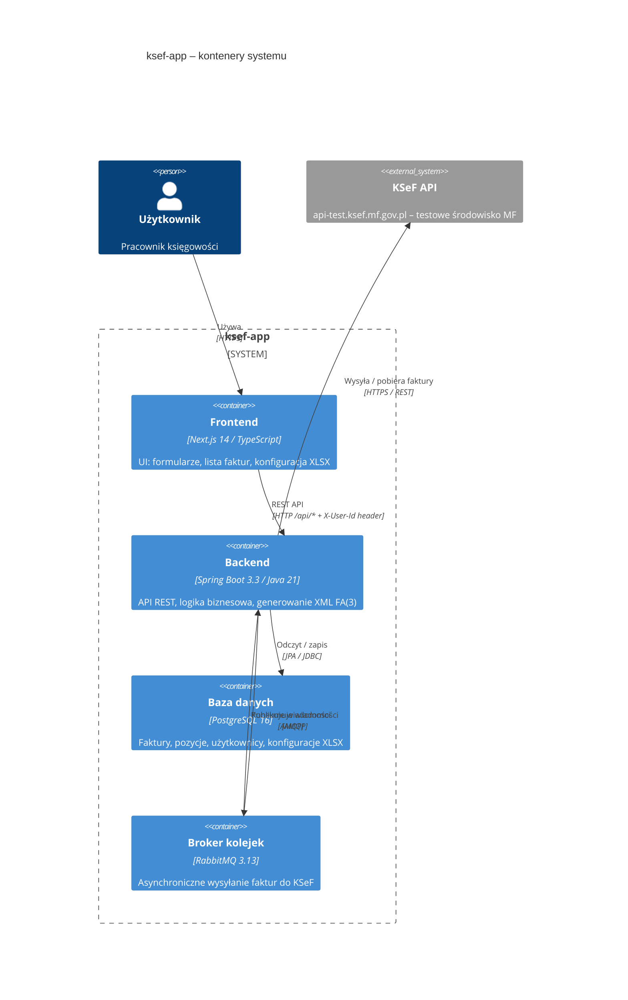
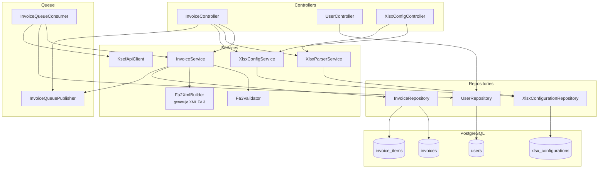
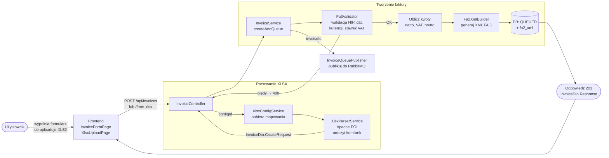
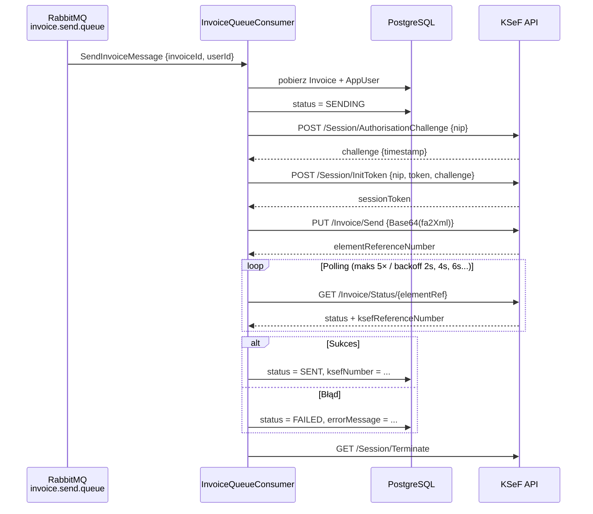
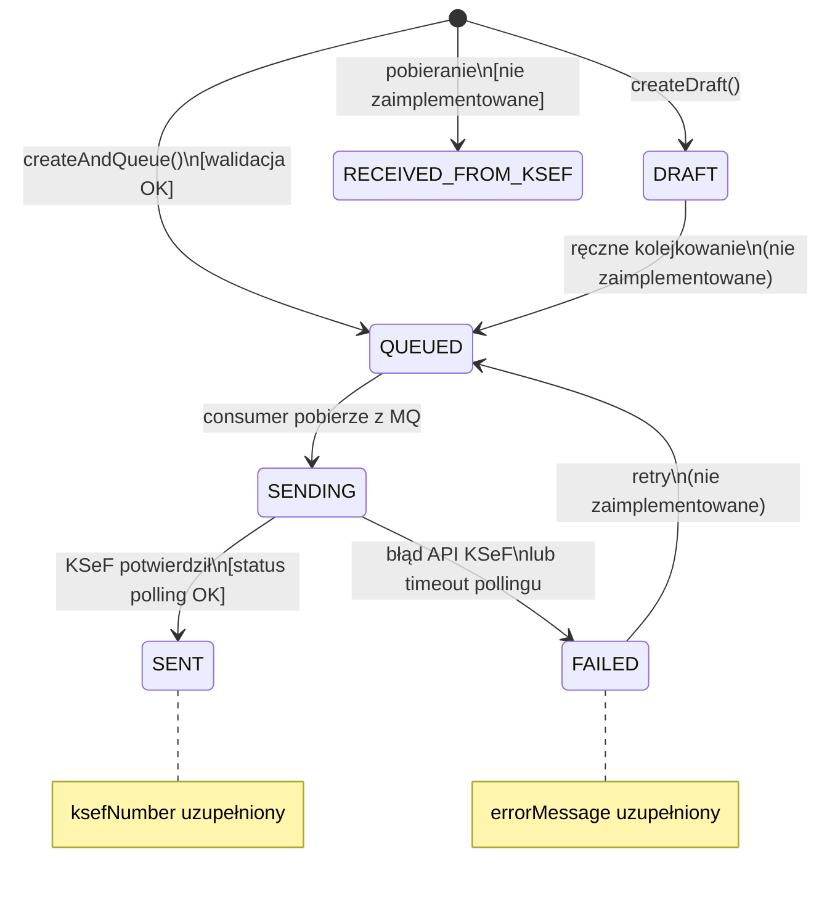
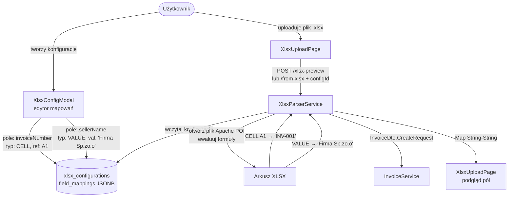
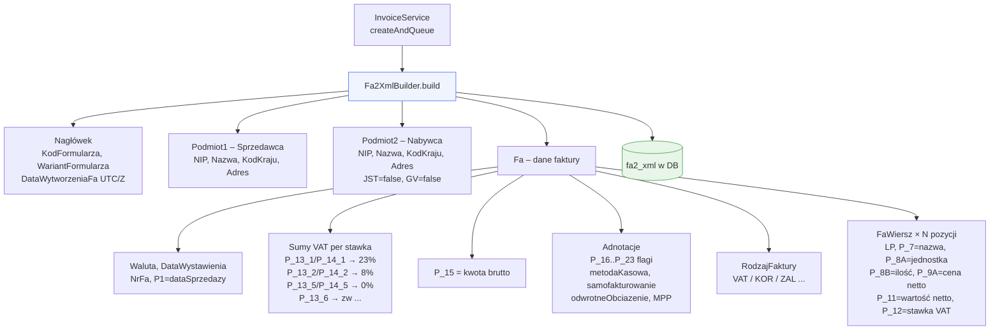
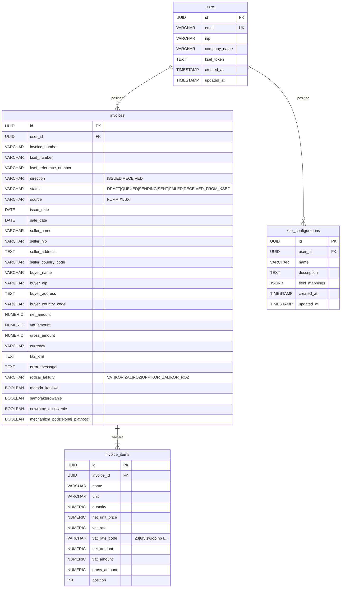

# Architektura systemu ksef-app

Diagramy opisujące działanie systemu. Renderuj przez VS Code (Mermaid Preview), GitHub lub https://mermaid.live.

---

## 1. Przegląd architektury (C4 – poziom kontenerów)



---

## 2. Warstwy backendu – zależności klas



---

## 3. Przepływ danych – formularz / XLSX → baza danych



---

## 4. Asynchroniczny przepływ – wysyłka do KSeF



---

## 5. Automat stanów faktury



---

## 6. Konfiguracja XLSX i parsowanie komórek



---

## 7. Generowanie XML FA(3)



---

## 8. Frontend – hierarchia komponentów i nawigacja

```mermaid
graph TD
    ROOT[layout.tsx\nQueryProvider + UserProvider]

    ROOT --> DASH[/ Dashboard\npage.tsx]
    ROOT --> LIST[/faktury\nInvoice List]
    ROOT --> NEW[/faktury/nowa\nNowy formularz]
    ROOT --> CFG[/konfiguracja\nUstawienia]

    DASH --> SB[StatusBadge]
    DASH --> NAV[Nav]

    LIST --> SB2[StatusBadge]
    LIST --> FMT[formatCurrency\nformatDate utils]

    NEW --> IFP[InvoiceFormPage\nformularz ręczny]
    NEW --> XUP[XlsxUploadPage\nupload pliku]
    IFP --> API1[invoicesApi\ncreateFromForm]
    XUP --> API2[invoicesApi\ncreateFromXlsx\npreviewXlsx]

    CFG --> UST[UserSetup\nrejestracja]
    CFG --> XCM[XlsxConfigModal\nedytor konfiguracji]
    CFG --> API3[usersApi\nupdateToken]
    CFG --> API4[xlsxConfigsApi\ncreate / update / delete]

    subgraph "Wspólny stan"
        UC[useUser hook\nlocalStorage → userId]
        RQ[React Query\ncache + refetch]
    end

    IFP --> UC
    XUP --> UC
    API1 --> RQ
    API2 --> RQ
    API3 --> RQ
    API4 --> RQ
```

---

## 9. Schemat bazy danych (ERD)


