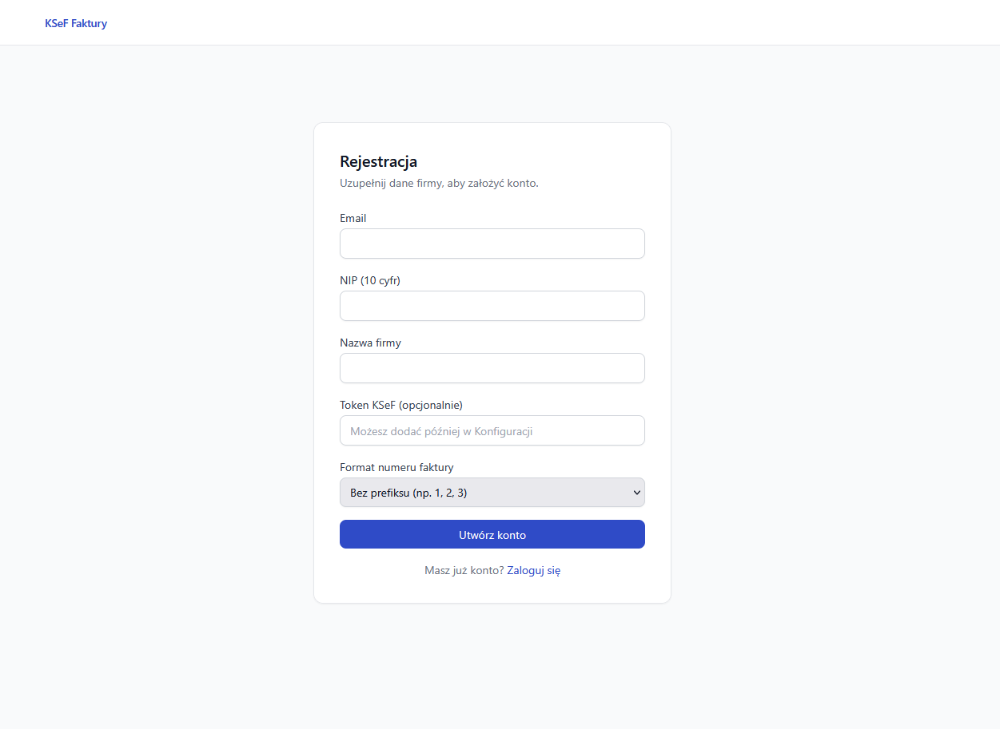
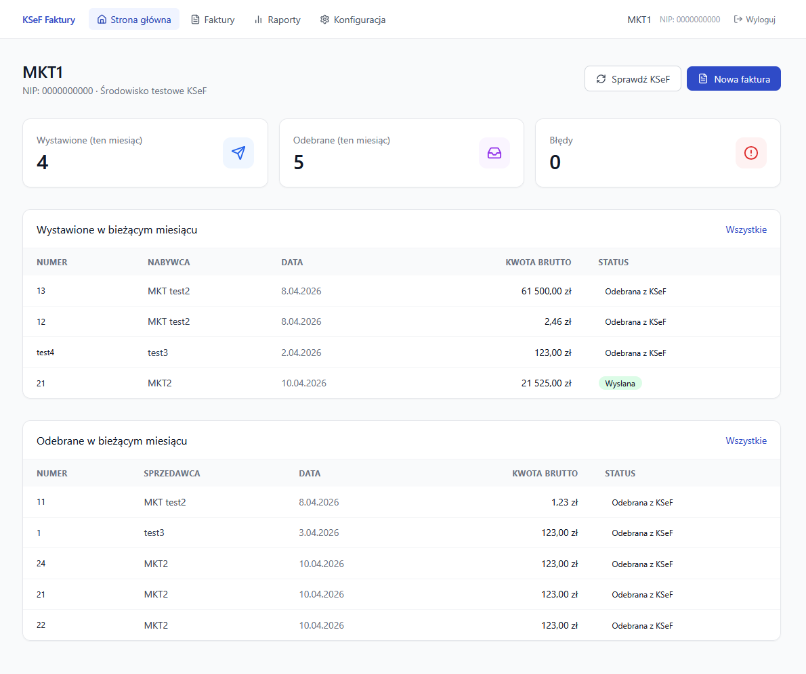
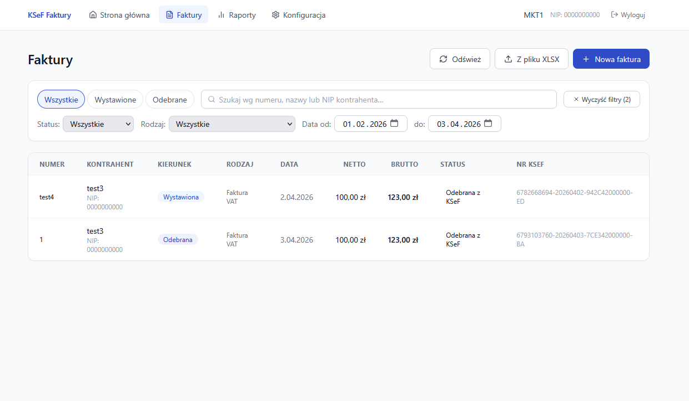
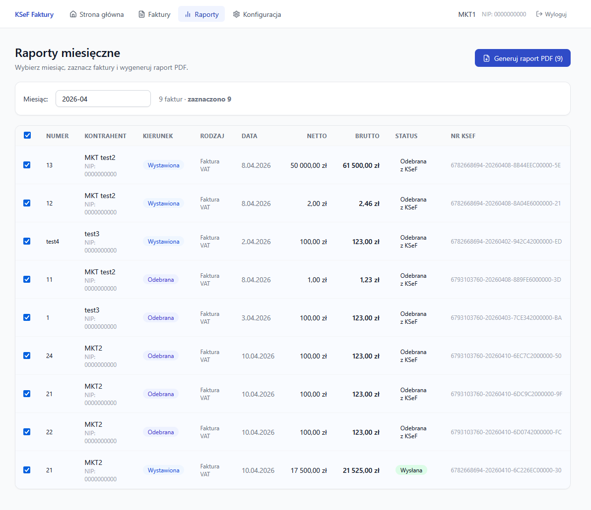
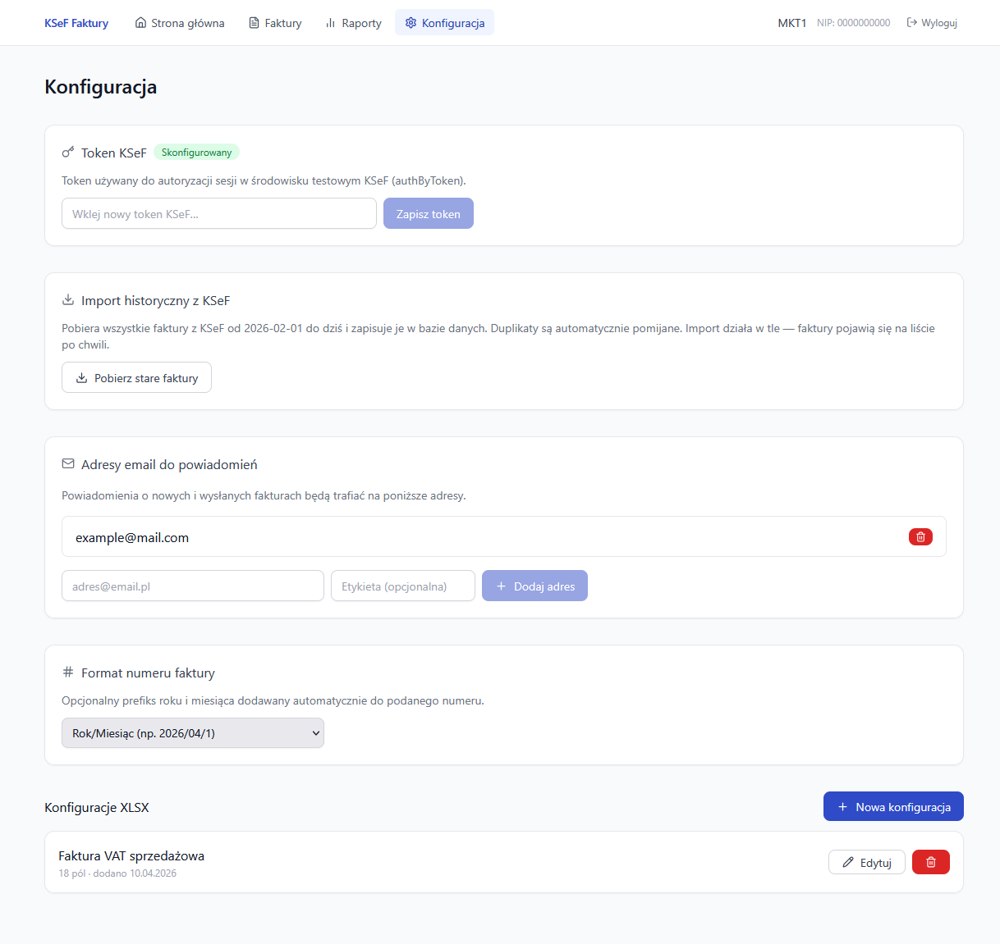
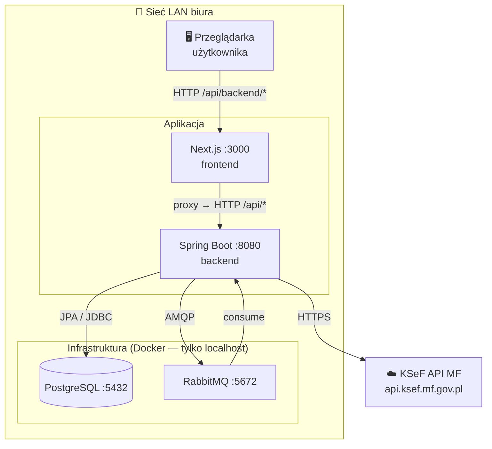
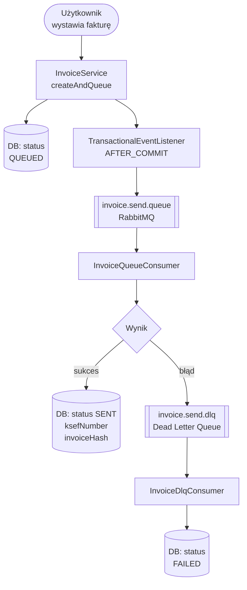
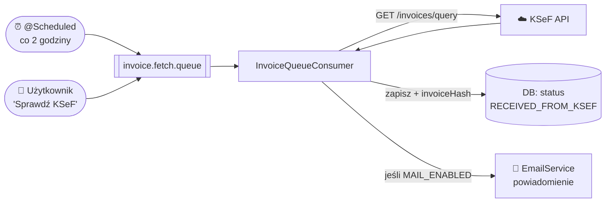

# KSeF Faktury — System zarządzania fakturami

Aplikacja webowa do wystawiania, odbierania i zarządzania fakturami przez API KSeF (Krajowy System e-Faktur Ministerstwa Finansów). Przeznaczona do pracy w sieci lokalnej biura.

---

## Screenshoty

**Rejestracja**


**Strona główna**


**Faktury**


**Raporty**


**Konfiguracja**


---

## Spis treści

1. [Opis funkcjonalny](#1-opis-funkcjonalny)
2. [Stack technologiczny](#2-stack-technologiczny)
3. [Architektura systemu](#3-architektura-systemu)
4. [Struktura projektu](#4-struktura-projektu)
5. [Backend — szczegóły](#5-backend--szczegóły)
6. [Frontend — szczegóły](#6-frontend--szczegóły)
7. [Baza danych](#7-baza-danych)
8. [Kolejkowanie i asynchroniczność](#8-kolejkowanie-i-asynchroniczność)
9. [Integracja z KSeF](#9-integracja-z-ksef)
10. [Konfiguracja e-mail](#10-konfiguracja-e-mail)
11. [API — pełna lista endpointów](#11-api--pełna-lista-endpointów)
12. [Zmienne środowiskowe](#12-zmienne-środowiskowe)
13. [Szybki start (środowisko deweloperskie)](#13-szybki-start-środowisko-deweloperskie)
14. [Wdrożenie na serwer biurowy](#14-wdrożenie-na-serwer-biurowy)
15. [Znane ograniczenia i roadmapa](#15-znane-ograniczenia-i-roadmapa)

---

## 1. Opis funkcjonalny

System umożliwia pracownikom biura rachunkowego:

| Funkcja | Opis |
|---------|------|
| **Wystawianie faktur** | Formularz ręczny lub import z pliku XLSX |
| **Odbieranie faktur** | Automatyczne pobieranie z KSeF co 2 godziny lub na żądanie |
| **Wysyłka do KSeF** | Asynchroniczna, z obsługą błędów i kolejką ponowień |
| **Format FA(3)** | Pełna obsługa formatu XML zgodnego z wymogami MF |
| **Konfiguracja XLSX** | Mapowanie komórek Excela na pola faktury (wiele szablonów) |
| **Powiadomienia e-mail** | Opcjonalne — przy nowej fakturze przychodzącej |
| **Podgląd statusów** | Dashboard z bieżącymi stanami faktur (QUEUED, SENT, FAILED…) |
| **Multi-użytkownik** | Każdy użytkownik ma własne faktury, token KSeF i konfiguracje XLSX |

### Obsługiwane typy faktur (RodzajFaktury)

`VAT` · `KOR` (korekta) · `ZAL` (zaliczkowa) · `ROZ` (rozliczeniowa) · `UPR` (uproszczona) · `KOR_ZAL` · `KOR_ROZ`

### Obsługiwane stawki VAT

`23%` · `8%` · `5%` · `0%` · `zw` (zwolniona) · `oo` (odwrotne obciążenie) · `np` (nie podlega) · `brak`

---

## 2. Stack technologiczny

| Warstwa | Technologia | Wersja |
|---------|-------------|--------|
| Frontend | Next.js, TypeScript, Tailwind CSS, TanStack Query, React Hook Form + Zod | Next.js 14.2 |
| Backend | Spring Boot, Java, Spring Data JPA, Spring AMQP, Spring Mail | Spring Boot 3.3.4 / Java 21 |
| Baza danych | PostgreSQL z migracjami Flyway | PostgreSQL 16 |
| Kolejka | RabbitMQ | 3.13 |
| Parsowanie XML | JAXB / custom Fa3XmlBuilder | — |
| Parsowanie XLSX | Apache POI | 5.3.0 |
| Mapowanie DTO | MapStruct | 1.6.2 |
| Konteneryzacja | Docker Compose (infrastruktura) | — |

---

## 3. Architektura systemu



Więcej diagramów (C4, przepływy danych, automat stanów, ERD) — patrz [ARCHITECTURE.md](ARCHITECTURE.md).

---

## 4. Struktura projektu

```
ksef-app/
├── backend/                          # Spring Boot
│   ├── .env                          # Sekrety (NIE w git)
│   └── src/main/java/pl/ksef/
│       ├── controller/               # REST: Invoice, User, XlsxConfig, NotificationEmail, Report, Config
│       ├── service/
│       │   ├── InvoiceService.java
│       │   ├── EmailService.java         # Opcjonalne powiadomienia
│       │   ├── XlsxParserService.java
│       │   ├── XlsxConfigService.java
│       │   ├── MonthlyReportService.java # Generowanie PDF raportu miesięcznego
│       │   ├── KsefPdfService.java       # Placeholder — oficjalne PDF KSeF (zablokowane F6/F7)
│       │   └── queue/                    # Publisher, Consumer, DlqConsumer
│       ├── ksef/                         # Integracja z API KSeF
│       │   ├── KsefApiClient.java
│       │   ├── KsefTokenManager.java
│       │   ├── KsefEncryptionService.java
│       │   ├── Fa3XmlBuilder.java
│       │   ├── Fa3XmlParser.java
│       │   └── Fa3Validator.java
│       ├── entity/                   # JPA: AppUser, Invoice, InvoiceItem, XlsxConfiguration, UserNotificationEmail
│       ├── repository/               # InvoiceRepository, UserRepository, XlsxConfigurationRepository, UserNotificationEmailRepository
│       ├── dto/                      # InvoiceDto, KsefDto, XlsxConfigDto
│       ├── config/                   # WebConfig (CORS), RabbitMQConfig, KsefClientConfig
│       └── exception/                # GlobalExceptionHandler
│   └── src/main/resources/
│       ├── application.yml           # Konfiguracja (ze zmiennymi środowiskowymi)
│       ├── fonts/                    # DejaVuSans.ttf, DejaVuSans-Bold.ttf (PDF)
│       └── db/migration/
│           ├── V1__init_schema.sql              # Schemat bazowy
│           ├── V2__user_invoice_prefix.sql      # Tryb prefiksu numeru faktury
│           └── V3__user_notification_emails.sql # Tabela adresów powiadomień
│
├── frontend/                         # Next.js
│   ├── .env.local                    # Konfiguracja lokalna (NIE w git)
│   ├── .env.example                  # Szablon (w git)
│   └── src/
│       ├── app/
│       │   ├── page.tsx              # Dashboard
│       │   ├── faktury/page.tsx      # Lista faktur
│       │   ├── faktury/nowa/page.tsx # Nowa faktura (formularz / XLSX)
│       │   ├── raporty/page.tsx      # Generowanie raportu miesięcznego PDF
│       │   └── konfiguracja/page.tsx # Token KSeF, prefiks, e-maile, konfiguracje XLSX
│       ├── components/               # Nav, StatusBadge, formularze, modale
│       ├── lib/
│       │   ├── api.ts                # Axios client + wszystkie endpointy
│       │   ├── user-context.tsx      # Kontekst użytkownika (localStorage)
│       │   └── utils.ts              # formatCurrency, formatDate
│       └── types/index.ts            # Typy TypeScript (Invoice, User, Enums…)
│
├── docker-compose.yml                # PostgreSQL + RabbitMQ
├── docker-compose.env                # Hasła dla docker-compose (NIE w git)
├── config.txt                        # Konfiguracja e-mail biura (NIE w git)
├── .gitignore
├── ARCHITECTURE.md                   # Diagramy Mermaid
├── README.md                         # Ten plik
└── SETUP.md                          # Instrukcja wdrożenia na serwer
```

---

## 5. Backend — szczegóły

### Kontrolery REST (6)

| Kontroler | Ścieżka bazowa | Opis |
|-----------|----------------|------|
| `InvoiceController` | `/api/invoices` | CRUD faktur, upload XLSX, wysyłka do KSeF |
| `UserController` | `/api/users` | Rejestracja, logowanie przez NIP, token KSeF, tryb prefiksu |
| `XlsxConfigController` | `/api/xlsx-configs` | Konfiguracje mapowań XLSX |
| `NotificationEmailController` | `/api/notification-emails` | Zarządzanie adresami e-mail powiadomień |
| `ReportController` | `/api/reports` | Generowanie raportu miesięcznego (lista + PDF) |
| `ConfigController` | `/api/config` | Informacja o aktywnym środowisku KSeF |

Wszystkie endpointy (poza `/api/users` i `/api/config`) wymagają nagłówka `X-User-Id` (UUID użytkownika).

### Serwisy kluczowe

**InvoiceService** — tworzy fakturę, waliduje FA(3), oblicza kwoty, generuje XML, publikuje zdarzenie do kolejki.

**Fa3XmlBuilder** — buduje XML zgodny ze schematem FA(3) v1.0E (Ministerstwo Finansów).

**Fa3Validator** — waliduje NIPy, daty, kody walut, stawki VAT, wymagane pola przed wysyłką.

**KsefApiClient** — klient HTTP do API KSeF: challenge-based auth, szyfrowanie payloadu AES-256-CBC (klucz publiczny MF), upload, polling statusu, pobieranie faktur przychodzących.

**KsefTokenManager** — zarządza cyklem życia tokenu KSeF: cache → refresh → pełna re-autoryzacja.

**XlsxParserService** — czyta komórki z pliku `.xlsx`/`.xls` przez Apache POI zgodnie z zapisaną konfiguracją mapowań. Obsługuje tryby CELL, MULTI_CELL i VALUE.

**MonthlyReportService** — generuje PDF raportu miesięcznego (tabela faktur + sumy VAT) za pomocą biblioteki OpenPDF.

**EmailService** — opcjonalne powiadomienia HTML o nowych fakturach przychodzących i potwierdzenia wysyłki (aktywowane przez `MAIL_ENABLED=true`).

### Obsługa błędów

`GlobalExceptionHandler` przechwytuje wyjątki i zwraca ujednolicone odpowiedzi HTTP. Nieprzetworzone wiadomości RabbitMQ trafiają do kolejki DLQ (`invoice.send.dlq`), skąd `InvoiceDlqConsumer` oznacza fakturę statusem `FAILED`.

---

## 6. Frontend — szczegóły

### Strony aplikacji

| URL | Strona | Opis |
|-----|--------|------|
| `/` | Dashboard | Statystyki miesiąca, ostatnie faktury, przycisk synchronizacji KSeF |
| `/faktury` | Lista faktur | Filtry: kierunek, status, typ, tekst, zakres dat; paginacja |
| `/faktury/nowa` | Nowa faktura | Zakładki: formularz ręczny lub upload XLSX z wyborem konfiguracji |
| `/raporty` | Raporty | Generowanie i pobieranie raportu miesięcznego w formacie PDF |
| `/konfiguracja` | Ustawienia | Token KSeF, tryb prefiksu numeru, adresy e-mail powiadomień, konfiguracje XLSX |

### Przepływ użytkownika — pierwsze uruchomienie

```
1. Otwórz aplikację → formularz rejestracji (email, NIP, nazwa firmy)
2. Wklej token KSeF w Konfiguracja → Token KSeF
   - Token testowy: https://ksef-test.mf.gov.pl
   - Token produkcyjny: https://ksef.mf.gov.pl
3. Opcjonalnie: utwórz konfigurację XLSX (zakładka Konfiguracja)
4. Wystawiaj faktury przez formularz lub upload XLSX
```

### Konfiguracja XLSX — jak działa

Dla każdego pola faktury definiujesz jeden z dwóch trybów:

| Tryb | Opis | Przykład |
|------|------|---------|
| **Stała wartość** | Ta sama wartość dla każdego pliku | `Firma XYZ Sp. z o.o.` |
| **Komórka** | Adres komórki w arkuszu Excela | Arkusz `0`, komórka `B5` |

Możesz mieć wiele konfiguracji (np. osobna dla faktur sprzedaży, osobna dla usług).
Przycisk **Testuj** — wgraj przykładowy plik i sprawdź podgląd wartości z konkretnych komórek.

---

## 7. Baza danych

**PostgreSQL 16**, migracje zarządzane przez **Flyway**.

| Tabela | Zawartość |
|--------|-----------|
| `users` | Użytkownicy: email, NIP, nazwa firmy, token KSeF, tryb prefiksu numeru faktury |
| `invoices` | Faktury: dane FA(3), status, kierunek, XML, numer KSeF, hash faktury |
| `invoice_items` | Pozycje faktur (do 10 na fakturę) |
| `xlsx_configurations` | Konfiguracje mapowań XLSX (field_mappings jako JSONB) |
| `user_notification_emails` | Dodatkowe adresy e-mail powiadomień per użytkownik |

Pełny schemat ERD — patrz [ARCHITECTURE.md](ARCHITECTURE.md) (diagram 9).

---

## 8. Kolejkowanie i asynchroniczność

Wysyłka faktury do KSeF odbywa się **asynchronicznie** przez RabbitMQ:



Pobieranie faktur przychodzących:



Zdarzenia wysyłkowe publikowane są przez `@TransactionalEventListener(AFTER_COMMIT)` — gwarantuje to, że wiadomość RabbitMQ zostanie wysłana dopiero po zapisie faktury w bazie.

---

## 9. Integracja z KSeF

Aplikacja obsługuje pełny cykl życia faktury w KSeF:

1. **Autoryzacja** — challenge-based auth tokenem użytkownika
2. **Szyfrowanie** — payload szyfrowany AES-256-CBC kluczem publicznym KSeF
3. **Wysyłka** — `PUT /Invoice/Send` z XML FA(3) zakodowanym w Base64
4. **Polling statusu** — odpytywanie KSeF (maks. 5 prób z backoff) po numer referencyjny
5. **Pobieranie przychodzących** — `GET /Invoice/Query` w oknie czasowym 3h

| Środowisko | URL API | URL podglądu faktury (KSeF v2) |
|------------|---------|-------------------------------|
| **TEST** | `https://api-test.ksef.mf.gov.pl/v2` | `https://qr-test.ksef.mf.gov.pl/invoice/{nip}/{DD-MM-YYYY}/{invoiceHash}` |
| **PRODUKCJA** | `https://api.ksef.mf.gov.pl/v2` | `https://qr.ksef.mf.gov.pl/invoice/{nip}/{DD-MM-YYYY}/{invoiceHash}` |

Konfiguracja środowiska przez zmienną `SPRING_PROFILES_ACTIVE` w `backend/.env`.

---

## 10. Konfiguracja e-mail

Powiadomienia e-mail o nowych fakturach przychodzących są **domyślnie wyłączone**.

Aby aktywować, ustaw w `backend/.env`:

```properties
MAIL_ENABLED=true
MAIL_HOST=smtp.twojafirma.pl
MAIL_PORT=587
MAIL_USERNAME=faktury@twojafirma.pl
MAIL_PASSWORD=twoje_haslo
MAIL_FROM=faktury@twojafirma.pl
```

Dane serwera pocztowego możesz pobrać z pliku `config.txt` (konfiguracja biurowego serwera e-mail).

Obsługiwane konfiguracje:
- SMTP z STARTTLS (port 587) — domyślny
- SMTP over SSL (port 465) — ustaw `MAIL_PORT=465`
- Gmail, Outlook 365, własny serwer biurowy

---

## 11. API — pełna lista endpointów

> Wszystkie endpointy (poza `/api/users` i `/api/config`) wymagają nagłówka: `X-User-Id: <uuid-użytkownika>`

### Faktury `/api/invoices`

```
GET    /api/invoices                     Lista z filtrowaniem i paginacją
       ?direction=ISSUED|RECEIVED
       &status=SENT|FAILED|...
       &search=tekst
       &rodzajFaktury=VAT|KOR|...
       &issueDateFrom=YYYY-MM-DD
       &issueDateTo=YYYY-MM-DD
       &page=0&size=20

GET    /api/invoices/{id}                Szczegóły faktury

POST   /api/invoices                     Nowa faktura z formularza (→ kolejkuje)
POST   /api/invoices/draft               Nowa faktura jako szkic (bez wysyłki)
POST   /api/invoices/{id}/send           Wyślij szkic do KSeF
POST   /api/invoices/from-xlsx           Nowa faktura z pliku XLSX
       ?configId=<uuid-konfiguracji>
POST   /api/invoices/xlsx-preview        Podgląd parsowania XLSX (bez zapisu)
       ?configId=<uuid-konfiguracji>
POST   /api/invoices/fetch               Pobierz faktury z KSeF (na żądanie)
```

### Konfiguracje XLSX `/api/xlsx-configs`

```
GET    /api/xlsx-configs                 Lista konfiguracji użytkownika
GET    /api/xlsx-configs/{id}            Szczegóły konfiguracji
POST   /api/xlsx-configs                 Nowa konfiguracja
PUT    /api/xlsx-configs/{id}            Aktualizacja konfiguracji
DELETE /api/xlsx-configs/{id}            Usunięcie konfiguracji
POST   /api/xlsx-configs/test-cell       Test odczytu komórki
       ?cellRef=A1&sheetIndex=0
```

### Użytkownicy `/api/users`

```
GET    /api/users/by-nip/{nip}           Znajdź użytkownika po NIP (logowanie)
GET    /api/users/{id}                   Dane użytkownika
POST   /api/users                        Rejestracja nowego użytkownika
PUT    /api/users/{id}/ksef-token        Aktualizacja tokenu KSeF
PUT    /api/users/{id}/invoice-prefix-mode  Tryb prefiksu numeru faktury (NONE | YEAR_MONTH)
```

### Adresy e-mail powiadomień `/api/notification-emails`

```
GET    /api/notification-emails          Lista adresów dla użytkownika
POST   /api/notification-emails          Dodaj adres e-mail
DELETE /api/notification-emails/{id}     Usuń adres e-mail
```

### Raporty `/api/reports`

```
GET    /api/reports                      Lista faktur za miesiąc
       ?year=2025&month=4
POST   /api/reports/generate-pdf         Pobierz raport miesięczny jako PDF
       body: { year, month }
```

### Konfiguracja środowiska `/api/config`

```
GET    /api/config/environment           Aktywne środowisko KSeF (test | prod)
```

---

## 12. Zmienne środowiskowe

### Backend (`backend/.env`)

| Zmienna | Domyślna | Opis |
|---------|---------|------|
| `SPRING_PROFILES_ACTIVE` | `ksef-test` | **Środowisko KSeF** — `ksef-test` lub `ksef-prod` |
| `DB_HOST` | `localhost` | Host PostgreSQL |
| `DB_PORT` | `5432` | Port PostgreSQL |
| `DB_NAME` | `ksef_db` | Nazwa bazy danych |
| `DB_USER` | `ksef_user` | Użytkownik bazy |
| `DB_PASS` | — | Hasło bazy (wymagane) |
| `RABBITMQ_HOST` | `localhost` | Host RabbitMQ |
| `RABBITMQ_PORT` | `5672` | Port AMQP |
| `RABBITMQ_USER` | `ksef_user` | Użytkownik RabbitMQ |
| `RABBITMQ_PASS` | — | Hasło RabbitMQ (wymagane) |
| `CORS_ALLOWED_ORIGIN_PATTERNS` | `http://localhost:3000` | Dozwolone originy CORS (np. `http://192.168.1.100:3000`) |
| `MAIL_ENABLED` | `false` | Włącz powiadomienia e-mail |
| `MAIL_HOST` | `smtp.gmail.com` | Serwer SMTP |
| `MAIL_PORT` | `587` | Port SMTP |
| `MAIL_USERNAME` | — | Login SMTP |
| `MAIL_PASSWORD` | — | Hasło SMTP |
| `MAIL_FROM` | `noreply@ksef-faktury.pl` | Adres nadawcy |
| `MAIL_SSL` | `false` | SSL (port 465) |
| `MAIL_STARTTLS` | `true` | STARTTLS (port 587) |

#### Przełączanie środowiska KSeF — profil `SPRING_PROFILES_ACTIVE`

Wartość zmiennej `SPRING_PROFILES_ACTIVE` w `backend/.env` aktywuje odpowiedni profil Spring Boot:

| Wartość | Środowisko | API URL | Limity | Endpointy `/testdata/*` |
|---------|-----------|---------|--------|------------------------|
| `ksef-test` | Testowe MF | `api-test.ksef.mf.gov.pl/v2` | 100 req/s | dostępne |
| `ksef-prod` | Produkcyjne MF | `api.ksef.mf.gov.pl/v2` | 10 req/s | niedostępne |

Konfiguracja każdego profilu w plikach:
- `backend/src/main/resources/application-ksef-test.yml`
- `backend/src/main/resources/application-ksef-prod.yml`

### Frontend (`frontend/.env.local`)

| Zmienna | Domyślna | Opis |
|---------|---------|------|
| `NEXT_PUBLIC_BACKEND_URL` | `http://localhost:8080` | Adres backendu widoczny z przeglądarki |

### Docker Compose (`docker-compose.env`)

| Zmienna | Opis |
|---------|------|
| `DB_NAME` | Nazwa bazy PostgreSQL |
| `DB_USER` | Użytkownik PostgreSQL |
| `DB_PASS` | Hasło PostgreSQL |
| `RABBITMQ_USER` | Użytkownik RabbitMQ |
| `RABBITMQ_PASS` | Hasło RabbitMQ |

---

## 13. Szybki start (środowisko deweloperskie)

### Wymagania

- Java 21+
- Node.js 20+
- Docker Desktop

### Uruchomienie

```bash
# 1. Infrastruktura (PostgreSQL + RabbitMQ)
docker-compose --env-file docker-compose.env up -d postgres rabbitmq

# 2. Backend (IntelliJ IDEA lub terminal)
cd backend
# Załaduj zmienne środowiskowe z docker-compose.env, następnie:
./mvnw spring-boot:run
# Backend: http://localhost:8080

# 3. Frontend
cd frontend
npm install
npm run dev
# Frontend: http://localhost:3000
```

> **IntelliJ IDEA**: Włącz przetwarzanie adnotacji:
> `Settings → Build → Compiler → Annotation Processors → Enable annotation processing`

Weryfikacja infrastruktury:
- PostgreSQL: `localhost:5432` (tylko z localhost)
- RabbitMQ Management UI: `http://localhost:15672` (tylko z localhost)

---

## 14. Wdrożenie na serwer biurowy

Szczegółowa instrukcja krok po kroku: **[SETUP.md](SETUP.md)**

Skrót:
1. Ustaw hasła w `backend/.env` i `docker-compose.env`
2. Zmień `NEXT_PUBLIC_BACKEND_URL` na IP serwera w `frontend/.env.local`
3. Ustaw `CORS_ALLOWED_ORIGINS` na IP serwera w `backend/.env`
4. Przestaw `KSEF_BASE_URL` na produkcję gdy gotowy
5. `docker-compose --env-file docker-compose.env up -d`
6. Zbuduj i uruchom backend + frontend

---

## 15. Znane ograniczenia i roadmapa

### Bieżące ograniczenia (przed wdrożeniem produkcyjnym)

| Ograniczenie | Szczegóły |
|-------------|-----------|
| **Brak JWT / Spring Security** | Nagłówek `X-User-Id` bez weryfikacji — do użytku tylko w zaufanej sieci LAN |
| **Tokeny KSeF w plaintext** | Kolumna `users.ksef_token` nieszyfrowana — zaplanowane w kolejnym etapie |
| **Brak retry dla FAILED** | Faktura z błędem wymaga ręcznego ponownego wysłania |
| **Maksymalnie 10 pozycji** | Parser XLSX obsługuje do 10 `invoice_items` na fakturę |
| **Brak wersjonowania faktur** | Szkice nie mają historii zmian |

### Planowane funkcje

- [ ] Spring Security + JWT (uwierzytelnianie i autoryzacja)
- [ ] Szyfrowanie tokenów KSeF w bazie (JPA AttributeConverter AES-256)
- [ ] Mechanizm retry dla faktur FAILED
- [ ] Zwiększenie limitu pozycji powyżej 10
- [ ] Generowanie oficjalnego PDF z faktury KSeF (zablokowane — biblioteka `ksef-pdf-generator` niedostępna w Maven Central)
- [ ] Eksport listy faktur do XLSX
- [ ] Obsługa certyfikatu kwalifikowanego (alternatywa dla tokenu KSeF)
